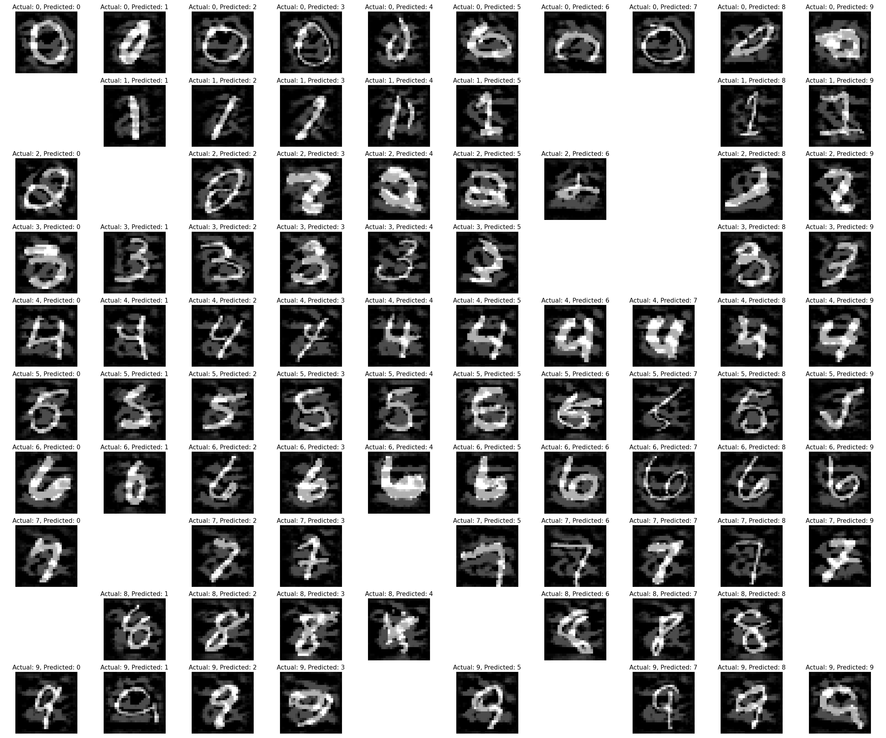
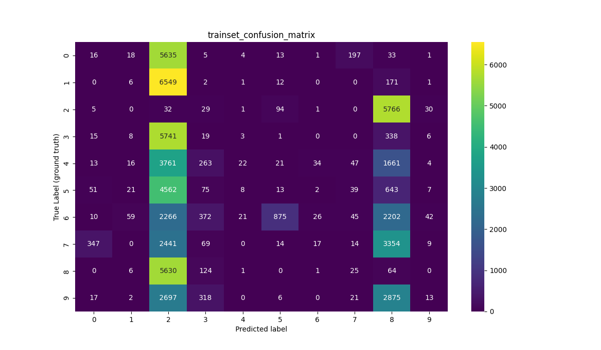

# Generating Adversarial Examples using Adv-GAN
This project is adapted from  https://github.com/mathcbc/advGAN_pytorch, and it is a Pytorch implementation of the paper ["Generating Adversarial Examples with Adversarial Networks" (Adv-GAN)](https://arxiv.org/abs/1801.02610v5) on MNIST dataset.

**See the complete report in:  
(English) https://github.com/yegmor/Final_Project/blob/main/english_report/english_report.pdf  
(Persian) https://github.com/yegmor/Final_Project/blob/main/Final%20Report.pdf, and presentation (Persian) in https://github.com/yegmor/Final_Project/blob/main/Presentation.pdf.**  

**NOTE:** This implementation is a little different from the paper, because a clipping trick has been added.  

# Run code

### Install the required packages
```shell
pip install -r requirements.txt
```

### Training the target model
```shell
python3 train_target_model.py
```

### Training the AdvGAN
```shell
python3 train_advGAN_model.py
```

### Testing adversarial examples using generator network of the trained AdvGAN
```shell
python3 test_adversarial_examples.py
```

# Results 
- The plots are available in `results` directory.
- The trained models are available in `models` directory.

## Outputs
### Target Network Architecture
`MNIST_target_net(`  
  `(conv1): Conv2d(1, 32, kernel_size=(3, 3), stride=(1, 1))`  
  `(conv2): Conv2d(32, 32, kernel_size=(3, 3), stride=(1, 1))`  
  `(conv3): Conv2d(32, 64, kernel_size=(3, 3), stride=(1, 1))`  
  `(conv4): Conv2d(64, 64, kernel_size=(3, 3), stride=(1, 1))`  
  `(fc1): Linear(in_features=1024, out_features=200, bias=True)`  
  `(fc2): Linear(in_features=200, out_features=200, bias=True)`  
  `(logits): Linear(in_features=200, out_features=10, bias=True)`  
`)`

### Evaluate the target model on the test set 
`test_num_correct: 9928  total test data: 10000`  
`model loss on testing set testing set: 1.612297`  
`model accuracy on testing settesting set: 0.992800`  

### Evaluate the target model on generated adversarial examples generated from train set 
`Training set per-class accuracy:`  
`[(0, 0.2026000337666723), (1, 0.059329575793533075), (2, 0.35246727089627394), (3, 0.326211058554885), (4, 0.15405682985279015), (5, 0.27670171555063644), (6, 0.08448800270361609), (7, 0.22346368715083798), (8, 0.6494616304905144), (9, 0.15128593040847202)]`  
`Training set F1 score (micro): 0.002450`  
`Training set F1 score (weighted): 0.002756`  
`Training set Accuracy score: 0.245000`  
`Training set attack success rate: 99.755000`

## Plots
- ### Generated adversarial examples  


***

- ### Confusion Matrix for the corresponding outputs of the target network for the adversarial examplesgenerated from train set   

